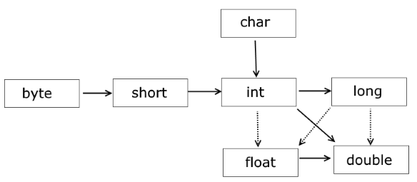

- Конспект лекций по курсу **[Java. Базовый курс](https://stepik.org/course/187/info)**
- Преподаватель: **[Алексей Владыкин](https://stepik.org/users/1647194)**
- Конспектировал: **[Курочкин Михаил](https://github.com/KlukvaMors)**


# 0. Содержание


- [1. Введение в Java](#1-Введение-в-Java)
    - [1.1 Что такое Java, откуда она взялась и зачем нужна](#11-Что-такое-Java-откуда-она-взялась-и-зачем-нужна)
    - [1.2 Первый контакт — Hello World](#12-Первый-контакт--Hello-World)
    - [1.3 Популярность Java](#13-Популярность-Java)
      - [1.3.1 Платформонезависимость](#131-Платформонезависимость)
    - [1.4 JDK vs JVM VS JRE](#14-JDK-vs-JVM-VS-JRE)
    - [1.3 Знакомство со средой разработки](#13-Знакомство-со-средой-разработки)
- [2. Базовый синтаксис Java](#2-Базовый-синтаксис-Java)
    - [2.1 Примитивные типы](#21-Примитивные-типы)
      - [2.1.1 Целочисленные](#211-Целочисленные)
        - [2.1.1.1 Различные виды записи целых чисел](#2111-Различные-виды-записи-целых-чисел)
      - [2.1.2 С плавающей точкой](#212-С-плавающей-точкой)
      - [2.1.3 Логический тип](#213-Логический-тип)
      - [2.1.4 Символьный тип](#214-Символьный-тип)
      - [2.1.5 Классы обертки примитивных типов](#215-Классы-обертки-примитивных-типов)
    - [2.2 Преобразование типов](#22-Преобразование-типов)
    - [2.3 Ссылочные типы данных](#23-Ссылочные-типы-данных)
    - [2.3 Массивы и строки](#23-Массивы-и-строки)
      - [Объявление-и-создание-массивов](Объявление-и-создание-массивов)
      - [Инициализация элементов массива](#Инициализация-элементов-массива)
      - [Многомерные массивы](#Многомерные-массивы)
    - [2.4 Управляющие конструкции: условные операторы и циклы](#24-Управляющие-конструкции-условные-операторы-и-циклы)
- [3. Объекты, классы и пакеты в Java](#3-Объекты-классы-и-пакеты-в-Java)
    - [3.1 Основы ООП](#31-Основы-ООП)
    - [3.2 Пакеты и модификаторы доступа](#32-Пакеты-и-модификаторы-доступа)
    - [3.3 Объявление класса](#33-Объявление-класса)
    - [3.4 Наследование. Класс Object](#34-Наследование-Класс-Object)
    - [3.5 Абстрактные классы и интерфейсы](#35-Абстрактные-классы-и-интерфейсы)
- [4. Обработка ошибок, исключения, отладка](#4-Обработка-ошибок-исключения,-отладка)
    - [4.1 Знакомство с исключениями](#41-Знакомство-с-исключениями)
    - [4.2 Обработка исключений. Try-catch](#42-Обработка-исключений-Try-catch)
    - [4.3 Логирование](#43-Логирование)
- [5. Ввод-вывод, доступ к файловой системе](#5-Ввод-вывод-доступ-к-файловой-системе)
    - [5.1 Доступ к файловой системе](#51-Доступ-к-файловой-системе)
    - [5.2 Потоки байт](#52-Потоки-байт)
    - [5.3 Потоки символов](#53-Потоки-символов)
    - [5.4 Продвинутые возможности](#54-Продвинутые-возможности)
- [6. Generics. Collections. Streams](#6-Generics-Collections-Streams)
    - [6.1 Generics](#61-Generics)
    - [6.2 Коллекции](#62-Коллекции)
    - [6.3 Функциональные интерфейсы](#63-Функциональные-интерфейсы)
    - [6.4 Stream API](#64-Stream-API)


# 1. Введение в Java

[К содержанию](#0-Содержание)

> You know why the java coders wear glasses?
> No, why?
> Because they don't c#


## 1.1 Что такое Java, откуда она взялась и зачем нужна

[Начало главы](#1-Введение-в-Java)


Парень Дюк смешной отвязный, а язык то нет. 


## 1.2 Первый контакт — Hello World

[Начало главы](#1-Введение-в-Java)

Hello world на Java :coffee: уже сам по себе довольно изъёбистый :expressionless: , что не обещает на ничего хорошо, но на что не идёт java программисты ради денег :money_mouth_face: .

**Java**

```java
public class HelloWorld {
    public static void main(String[] args) {
        System.out.println("Hello World");
    }
}
```

Его младший братик C sharp ничем не лучше его в написание первой программы.

**C sharp**

```C sharp
namespace HelloWorld
{
    class Hello {        
        static void Main(string[] args)
        {
            System.Console.WriteLine("Hello World");
        }
    }
}
```

Мой любымий питонячий язык :snake: конечно же всех уделывает :grinning:

**Python**

```python
print("Hello World")
```


## 1.3 Популярность Java

- Платформонезависимость и портируемость
- ООП язык 
- Безопасность 
- Богатое API
- Вездеприсущий
  - Web Applications (Java EE (JSP, Servlets), Spring, Struts..)
  - Mobile Apps(Android)
  - Microservices (Spring Boot)


#### 1.3.1 Платформонезависимость

Скомпилировано один раз (в байт код), работает везде.


## 1.4 JDK vs JVM VS JRE

- JVM (Java Virtual Machine)
  - запускает Java bytecode.
- JRE
  - **JVM** + Libraries + Other Components (to run applets and other java applications)
- JDK
  - **JRE** + Compilers + Debuggers


## 1.3 Знакомство со средой разработки

[Начало главы](#1-Введение-в-Java)


# 2. Базовый синтаксис Java

[К содержанию](#0-Содержание)


## 2.1 Примитивные типы

[Начало главы](#2-Базовый-синтаксис-Java)

В Java есть **8** примитивных типов, которые делят на группы:

1. Целые числа - `byte`, `short`, `int`, `long`
2. Числа с плавающей точкой - `float`, `double`
3. Логический - `boolean`
4. Символьный - `char` (часто причисляют к целым числам)

### 2.1.1 Целочисленные

| Тип данных | Бит  | Диапазон                                                 | Порядок ~          |
| ---------- | ---- | -------------------------------------------------------- | ------------------ |
| byte       | 8    | -128 ... 127                                             | +- сотня           |
| short      | 16   | -32 768 ... 32 767                                       | +- 30 тысяч        |
| int        | 32   | -2 147 483 648 ... 2 147 483 647                         | +- 2 милиарда      |
| long       | 64   | -9 223 372 036 854 775 808 ... 9 223 372 036 854 775 807 | +- 9 квинтиллионов |
| char       | 16   | 0 ... 65535 (хранит символы в формате UTF-16)            |                    |


```java
byte b = 216; // Вот тут будет ошибка, т.к. у нас диапазон от -128 до 127!
short s = 1123;
int i = 64536;
long l = 2147483648L; // Постфикс l или L обозначает литералы типа long
//рекомендуется использовать постфикс L, так как l м.б. похоже на единицу
int i1 = 2_147_483_647; //для удобства чтения числ человеком их можно записывать так

```


#### 2.1.1.1 Различные виды записи целых чисел

```java
int decimal = 99;
int octal = 0755;
int hex = 0xFF;
int binary = 0b101;
int tenMillion = 10 _000_000;
long tenBillion = 10 _000_000_000L;
```


### 2.1.2 С плавающей точкой

| Тип данных | Бит  | Мантисса (бит) | Порядок (бит)  |
| ---------- | ---- | -------------- | -------------- |
| float      | 32   | 23             | `32 - 23 = 9`  |
| double     | 64   | 52             | `64 - 52 = 12` |


```java
double a, b = 4.12;
a = 22.1 + b;
float pi = 3.14f; // При использовании типа float требуется указывать суффикс f или F
// так как без них типом литерала будет считаться double
float anotherPi = (float) 3.14; // Можно привести явно
double c = 27;
double d = pi * c;
```


**TODO**: описать, что такое мантисса и порядок

### 2.1.3 Логический тип

| Тип данных | Бит  | Значения        |
| ---------- | ---- | --------------- |
| boolean    | 8    | `true`, `false` |

```java
// прямое присваивание
boolean brushedTeethToday = true;
boolean haveDog = false;
// как результат условия
boolean iKnowMath = 1 < 100;
// Main.java:3: error: incompatible types: int cannot be converted to boolean
boolean fromInt = 10;
```

К типу `boolean` можно применять логические операции

```java
//логическое отрицание
boolean haveSpareTime = !isBusy;
//логическое "И"
boolean canGoToPark = haveSpareTime && weatherIsGood;
//логическое "ИЛИ"
boolean hadGoodTime = learnedJavaOnStepic || wentToPark;
//логическое исключающее "ИЛИ"
boolean tastesGood = addedKetchup ^ addedHoney;
```


### 2.1.4 Символьный тип

| Тип данных | Бит  | Диапазон                                      | Значения                     |
| ---------- | ---- | --------------------------------------------- | ---------------------------- |
| char       | 16   | 0 ... 65535 (хранит символы в формате UTF-16) | `'a'`, `'\n'`, `'1'`, `'\\'` |


### 2.1.5 Классы обертки примитивных типов

| Примитивный тип | Класс обёртка |
| --------------- | ------------- |
| boolean         | Boolean       |
| byte            | Byte          |
| short           | Short         |
| int             | Integer       |
| long            | Long          |
| char            | Character     |
| float           | Float         |
| double          | Double        |


## 2.2 Преобразование типов

[Начало главы](#2-Базовый-синтаксис-Java)





## 2.3 Ссылочные типы данных

[Начало главы](#2-Базовый-синтаксис-Java)

Все типы отличные от примитивов в Java это объекты. Доступ к объекту осуществляется по ссылке. 


Объявляем ячейку памяти, в которой будет хранится объект типа `BigInteger`.
На данный момент никакой объект не создался, а ячейка вместо ссылки хранит значение `null`.

```java
BigInteger number; 
```

Создаём объект типа `BigInteger` и помещаем ссылку на него в ячейку памяти по названием `number`.
Сами объекты хранятся в `Heap` а ссылки на них в `Stack`.
Ключевое слово `new` также вызывает конструктор объекта

```java
number = new BigInteger("123456");
```

Объект удаляется автоматически с помощью сборщика мусора `Garbage Collector` :broom: .
Сборщик мусора удаляет объект, когда в программе не осталось таких ссылок, по который можно было бы добраться до объекта.
На это свойство можно посмотреть под углом философии: человек умирает тогда, когда на него уже ничего не указывает ничто.
Соответственно поэтому Цой жив :metal: :guitar:!
По этому же определению могут быть живые телом люди, которые мертвы, если на них ничто не указывает.

А ты, друг мой, живой :question: 

```java
number = null; //удаляем ссылку, сейчас на объект ничего не указывает
```

Но это не обозначает, что сборщик мусора удалил объект прямо сейчас.
Сборщик мусора вызывается произвольно.
Произвольный запуск сборщика мусора может вызывать баттхёрт :confounded: и геморрой у программистов и пользователей Java программ.

> Представьте вы на свидание и вдруг придавило клапан :flushed:
> Вы ищете сборщик мусора :toilet: , который уберёт остатки переработанной картошечки :bowl_with_spoon: с селёдочкой съеденной накануне.
> Вы находите умный клозет :wc: под управлением Java программы :coffee:
> Кидаете монетку :moneybag: дабы войти в сее чудо техники, но на моменте оплаты Java-сборщик-мусора решает почистить свою память.
> Туалет зависает, ваш клапан пробивает, свидание испорчено, платье испачкана


## 2.3 Массивы и строки

[Начало главы](#2-Базовый-синтаксис-Java)

#### Объявление и создание массивов

```java
int[] a;//массивы объявляются так
int b[]; // или разночачно так, но лучше делать первым способом
// сейчас мы объявили ссылку на массив, но создали их
a = new int[100]; //создали массив со 100 элементами
//каждый элемент массивы по умолчанию заполняется значениями, для числочисленных типов это 0
boolean[] bits = new boolean[8]; //объявлять и создавать массивы можно одновремено
// в boolean значение по умолчанию будет false
String[] strs = new String[4]; //также массив может состоять из ссылочных типов данных
//они заполняются по умолчанию значениями null
```

#### Инициализация элементов массива

```java
int[] a = new int[] {1, 2, 3, 4, 5, 6};
//при создание можно перечислить элементы, которые будут храниться в массиве
int[] b = {1, 2, 3, 4, 5, 6};
// эта запись имеет и короткую форму, но такая запись позволительна когда мы объявляем и создаём массив одновремено, как тут

int length = b.length;//длинна массива
int first = b[0];//обращение к первому элементу
int last = b[b.length -1];////обращение к последнему элементу
int indexOutOfBound = b[b.length];//обращение к несуществующему элементу вызовет исключение
```

#### Многомерные массивы

```java
int[][] maxrix1 = new int[][];

int[][] maxrix2 = new {{1, 2},
                       {3, 4}};

int[] firstRow = matrix2[0];

int someElement = matrix2[1][1];

int[][] triangle = {
    {1, 2, 3, 4, 5},
    {6, 7, 8, 9},
    {10, 11, 12},
    null,
    {13, 14},
    {15}
};
```


#### Аргументы переменной длины

Синтаксис выглядит для переменных типа `String` следующим образом:

```java
public void getData(String ... data){

   //your code here...

}
```

В языке Java эта возможность появилась начиная с JDK5.

Для чего же такой функционал может понадобиться? Вариантов множество. Самый простой - Вам нужно реализовать метод **sum()**, который будет суммировать два числа. Правда, что тут сложного:

```java
public class Summator {

   public static void main(String[] s){
      int x = 5;
      int y = 5;
      int res = sum(x, y);
      System.out.println(res);

   }

   public static int sum(int a, int b){
      return a+b;
   }

}
```

На следующий день к Вам забегает заказчик и говорит что задача изменилась, и в метод **sum()** нужно передавать три параметра… нет, возможно, 4… или 10… Ну можно перегрузить метод для 3, 4 или 10 аргументов:

```java
public class Summator {

   public static void main(String[] s){
      int x = 5;
      int y = 5;
      int res = sum(x, y);
      System.out.println(res);

   }

   public static int sum(int a, int b){
      return a+b;
   }
     
   public static int sum(int a, int b, int c){
      return a+b+c;
   }
    
   public static int sum(int a, int b, int c, int d){
      return a+b+c+d;
   }
    
   // и так дальше до 10

}
```

И компилятор это стерпит. И это даже будет работать. Но пожалейте же себя!

Если количество аргументов заведомо неизвестно, есть специальная запись - **(int ... nums)**:

```java
public class Summator {

   public static void main(String[] s){
      int x = 5;
      int y = 5;
       //мы можем передать сколько угодно параметров
      int res = sum(x, y, 1, 3, 4, 5, 6, 7, 8);
      //или даже передать массив
      int[] ar = new int[]{1, 2, 5, 7, 11};
      int res2 = sumData(ar);  
      System.out.println(res);
      System.out.println(res2);

   }

   public static int sum(int ... nums){
       int res=0;
       for(int i: nums){
           res+=i;
       }
       return res;
   }

}
```


## 2.4 Управляющие конструкции: условные операторы и циклы

[Начало главы](#2-Базовый-синтаксис-Java)


# 3. Объекты, классы и пакеты в Java

[К содержанию](#0-Содержание)


## 3.1 Основы ООП

[Начало главы](#3-Объекты-классы-и-пакеты-в-Java)


## 3.2 Пакеты и модификаторы доступа

[Начало главы](#3-Объекты-классы-и-пакеты-в-Java)


## 3.3 Объявление класса

[Начало главы](#3-Объекты-классы-и-пакеты-в-Java)


## 3.4 Наследование. Класс Object

[Начало главы](#3-Объекты-классы-и-пакеты-в-Java)


## 3.5 Абстрактные классы и интерфейсы

[Начало главы](#3-Объекты-классы-и-пакеты-в-Java)


# 4. Обработка ошибок, исключения, отладка

[К содержанию](#0-Содержание)


## 4.1 Знакомство с исключениями

[Начало главы](#4-Обработка-ошибок-исключения-отладка)


## 4.2 Обработка исключений. Try-catch

[Начало главы](#4-Обработка-ошибок-исключения-отладка)


## 4.3 Логирование

[Начало главы](#4-Обработка-ошибок-исключения-отладка)


# 5. Ввод-вывод, доступ к файловой системе

[К содержанию](#0-Содержание)


## 5.1 Доступ к файловой системе

[Начало главы](#5-Ввод-вывод-доступ-к-файловой-системе)


## 5.2 Потоки байт

[Начало главы](#5-Ввод-вывод-доступ-к-файловой-системе)


## 5.3 Потоки символов

[Начало главы](#5-Ввод-вывод-доступ-к-файловой-системе)


## 5.4    Продвинутые возможности

[Начало главы](#5-Ввод-вывод-доступ-к-файловой-системе)


# 6. Generics. Collections. Streams

[К содержанию](#0-Содержание)


## 6.1 Generics  

[Начало главы](#6-Generics-Collections-Streams)


## 6.2 Коллекции

[Начало главы](#6-Generics-Collections-Streams)


## 6.3 Функциональные интерфейсы  

[Начало главы](#6-Generics-Collections-Streams)


## 6.4 Stream API  

[Начало главы](#6-Generics-Collections-Streams)
